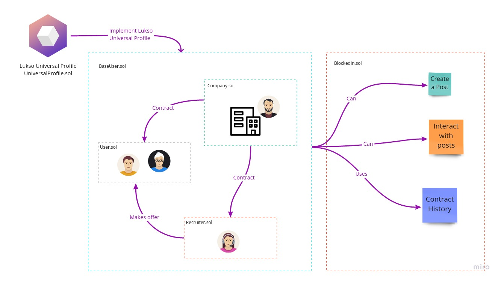

# BlockedIn

 

A Decentralized professional networking and career development social media app built with Web3 technologies

# License

Trust Wallet Core is available under the GNU General Public License version 3. See the [LICENSE](LICENSE) file for more info.